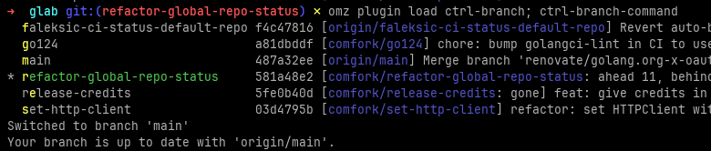

Oh-My-Zsh plugins.

* [**ctrl-branch**](ctrl-branch) - press Ctrl+B to switch git branch with a single letter shortcut.



```sh
ln -s $PWD/ctrl-branch ~/.oh-my-zsh/custom/plugins/

omz plugin enable ctrl-branch 
```
