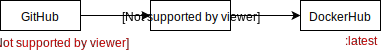
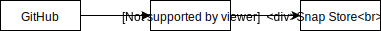

Yak Shave Inc. operations. Copy/paste code yourself, open an issue,
or reach @abitrolly through https://t.me/abitrolly for support
requests or project offers that require this expertise.

#### Known Elements

* [x] GitHub (https://github.com/yakshaveinc/linux)
* [x] Travis CI (https://travis-ci.org/yakshaveinc/linux)
* [x] DockerHub (https://hub.docker.com/r/yakshaveinc)
  * [x] `yeesus` account for automatic builds
* [x] Snap Store (https://snapcraft.io/yakshaveinc)
* [x] CirrusCI (https://cirrus-ci.com/github/yakshaveinc/linux)

#### Mastered Operations

* [x]  - Setting TravisCI for automating Linux, Docker and snap builds
* [x]  - Setting CirrusCI for automating Docker builds
* [x] Automatic deploy of Docker containers from Travis CI to DockerHub  
      
* [x] Automatic build and publish from Travis CI to Snap Store  
      
  * https://snapcraft.io/yakshaveinc (@abitrolly)
  * https://snapcraft.io/gitless (@techtonik, @abitrolly)
