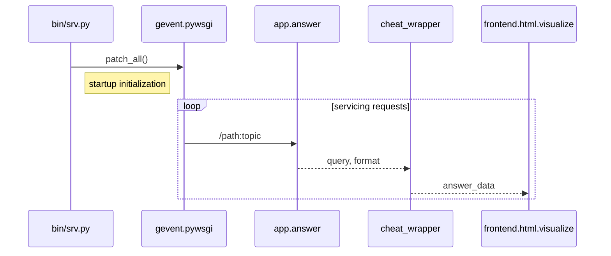

### `cheat.sh` request processing (https://github.com/chubin/cheat.sh/pull/344)

```mermaid
sequenceDiagram
bin/srv.py->>gevent.pywsgi: patch_all()
Note right of bin/srv.py: startup initialization
loop servicing requests
  gevent.pywsgi->>app.answer: /path:topic
  app.answer-->>cheat_wrapper: query, format
  cheat_wrapper-->>frontend.html.visualize: answer_data
end
```
