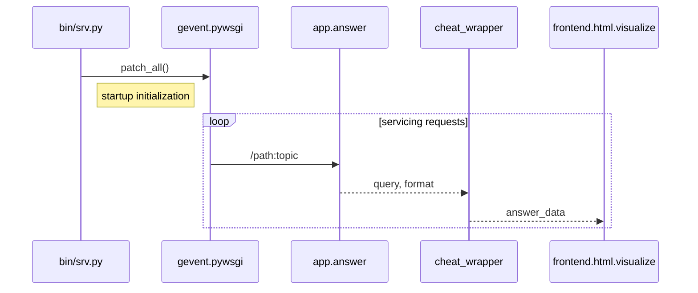
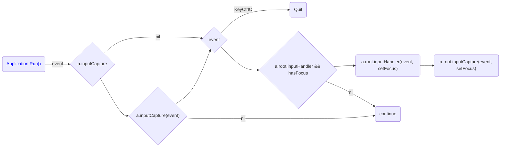

### `cheat.sh` request processing (https://github.com/chubin/cheat.sh/pull/344)

```mermaid
sequenceDiagram
bin/srv.py->>gevent.pywsgi: patch_all()
Note right of bin/srv.py: startup initialization
loop servicing requests
  gevent.pywsgi->>app.answer: /path:topic
  app.answer-->>cheat_wrapper: query, format
  cheat_wrapper-->>frontend.html.visualize: answer_data
end
```

### `tview` shortcuts processing (https://github.com/rivo/tview/issues/715#issuecomment-1146668208)

```mermaid
flowchart LR
    A("Application.Run()") -->|event| ICSET{a.inputCapture}
    ICSET -- nil --> CtrlC{event}
    CtrlC -- KeyCtrlC --> Q(Quit)

    ICSET --> AICE{"a.inputCapture(event)"}
    AICE --> CtrlC

    CtrlC --> ARIH{a.root.inputHandler && hasFocus}
    ARIH --> ARIHE("a.root.inputHandler(event, setFocus)")
    AICE -- nil --> C(continue)
    ARIH -- nil --> C

    ARIHE --> ARICE("a.root.inputCapture(event, setFocus)")
    
    click A "https://github.com/rivo/tview/blob/9994674d60a85d2c18e2192ef58195fff743091f/application.go#L309" _blank
    classDef link color:blue
    class A link
```
